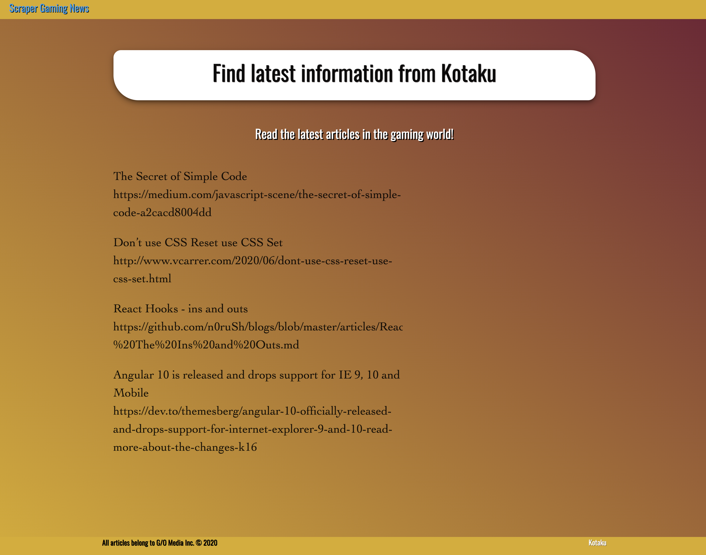
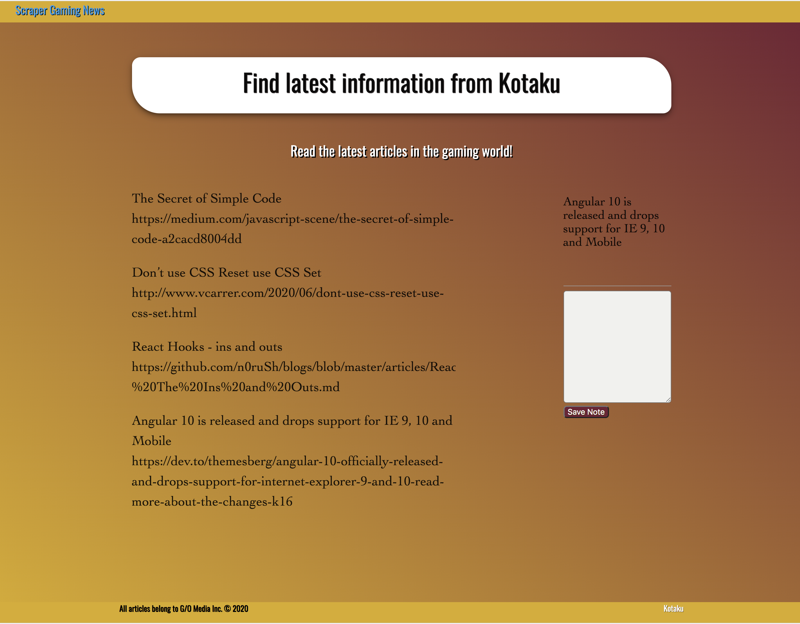

# 18-Scraping-Articles

Heroku link https://scraping-articles.herokuapp.com/
GitHub link https://melaniebott2691.github.io/18-Scraping-Articles/

Web app that lets users view and leave comments on news articles using Mongoose and Cheerio to scrape news from the news site.

## Instructions for application

#### To run application run npm init. 
##### Installation of npm packages:
- express
- express-handlebars
- mongoose
- cheerio
- axios
- body-parser

Deployment of application to Heroku set with mLab provision.

#### When users visit the site the app will scrape news articles from https://kotaku.com/ and display them for the user. Each article that is scraped will save to the applications database displaying: 
- Title
- Summary
- URL

#### Screenshots

